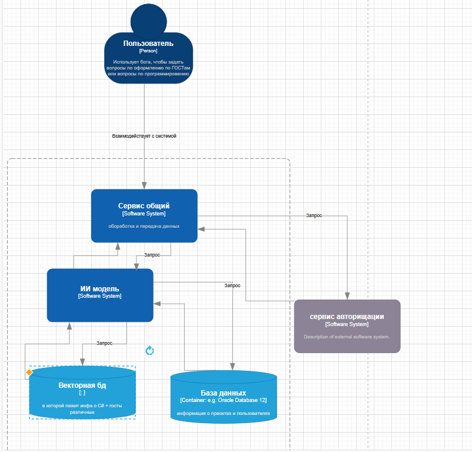

## Диаграмма системного контекста
Основные элементы:

- Пользоваетль взаимодейтсвует с систмемой через тг-бота для ответа на его вопрос по C# или же оформления отчётов по Гостам
- Система управляет типом ответа (прямой или наводящий) в зависимости от того кто именно заадал вопрос (преподаватель или студент).
- рагнутая ИИ моделей выступает как внешняя система, предоставляющая ответы через API  

## Диаграмма контейнеров
Стиль: **Почти** микросервисная архитектура
1. Есть несколько независимых сервисов, каждый решает свою задачу:
    - “Сервис общий” (он же основной backend), который получает запросы от бота, обрабатывает логику, маршрутизирует их.
    - ИИ-модель (отдельный сервис/модуль), выполняющий генерацию или анализ текстов.
    - Сервис авторизации (внешний или выделенный), отвечающий за аутентификацию и проверку прав доступа.
2. Хранение данных разделено на:
    - Основную БД (реляционную) для пользовательских данных, проектов, статистики.
    - Векторную БД для семантических эмбеддингов (нужна именно для AI-задач).
3. Гибкость в дальнейшем развитии:
    - Можно менять или улучшать ИИ-модель, не затрагивая всю систему.
    - При увеличении нагрузки есть возможность масштабировать один из сервисов (например, ИИ-модель) отдельно.

## Диаграмма компонентов

