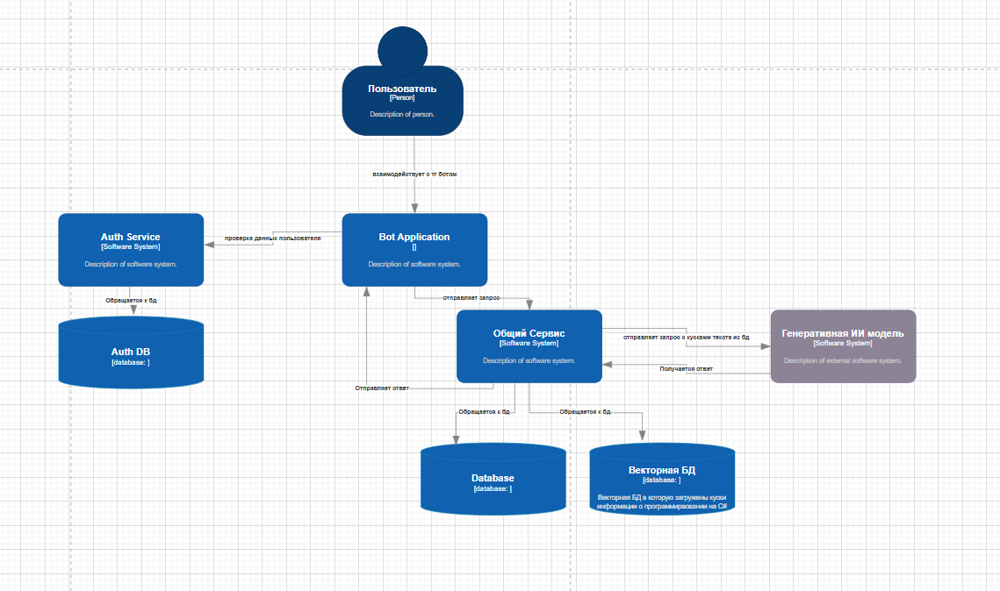
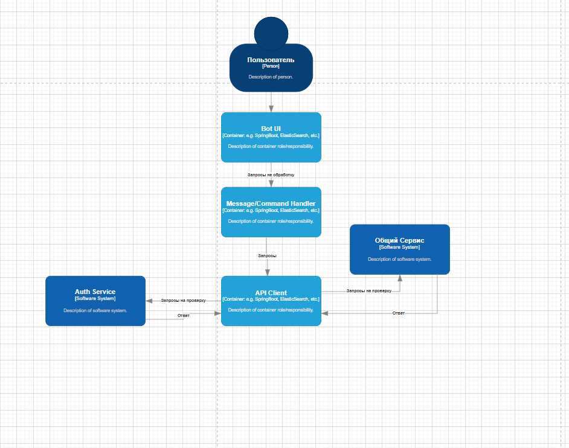
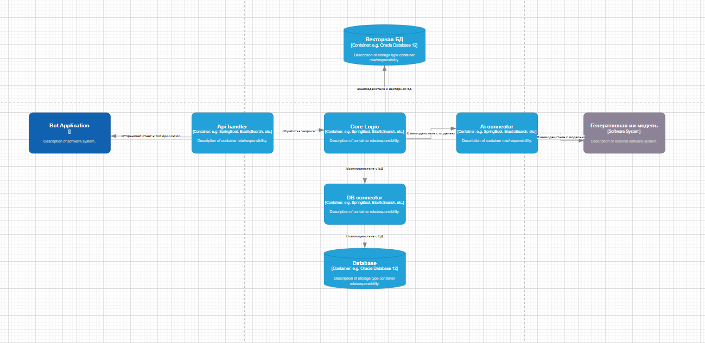
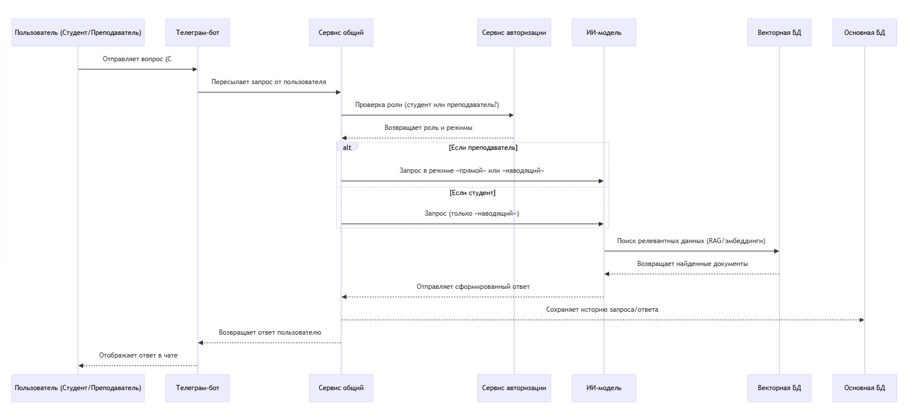
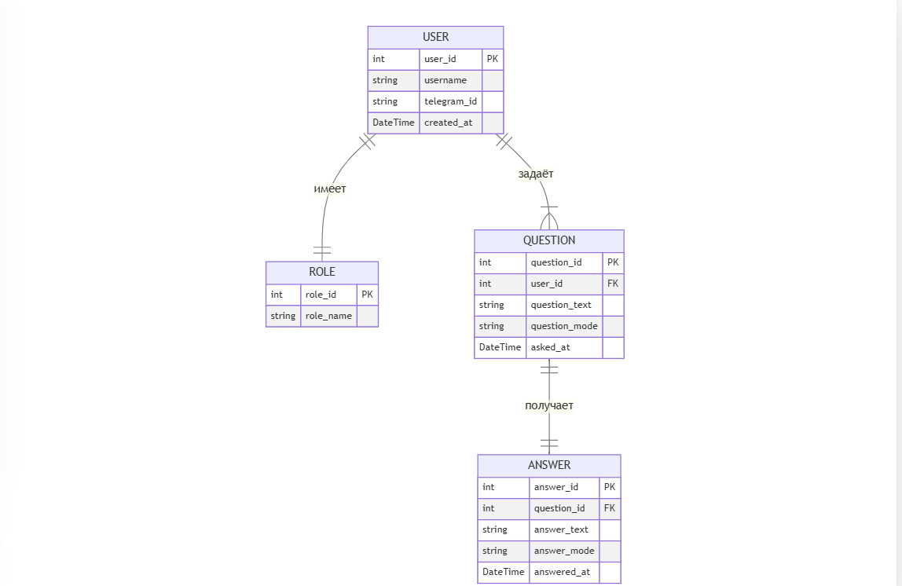

## Диаграмма контейнеров

## Диаграмма компонентов

**Компоненты «Bot application»**

**Компоненты «Общего Сервиса»**

## Диаграмма последовательности

## Модель БД

## Применение основных принципов разработки
1. **KISS (Keep It Simple, Stupid)**  
   - Структура кода должна быть максимально простой и понятной. Например, хранить логику обработки запросов в отдельных функциях/классах, не перегружая бизнес-логику лишними деталями.
   - Использовать удобочитаемые имена модулей и переменных, а также модули/библиотеки стандартной библиотеки Python (logging, sqlite, os и т.д.) там, где это уместно.

2. **DRY (Don’t Repeat Yourself)**  
   - Вынести повторяющуюся логику (например, отправка сообщений в Телеграм, обращение к модели) в отдельные функции или классы.  
   - При использовании векторной БД или внешнего сервиса, обернуть их в отдельный модуль/класс, чтобы повторно не копировать код подключения и запросов.

3. **Разделение ответственности (Single Responsibility Principle)**  
   - Разделите бота на чёткие модули:  
     - Модуль для работы с Telegram API (получение/отправка сообщений).  
     - Модуль для обращения к ИИ-модели (RAG, запросы к векторной БД).  
     - Модуль для бизнес-логики (определение режима ответа: преподавательский или студенческий).  
   - Это поможет избежать путаницы и упростит отладку.

4. **Тестирование и отладка**  
   - Использование модуля `unittest` или `pytest` для написания тестов ключевых функций (обработка сообщений, вызов модели, сохранение данных).  
   - Настройка логирования (модуль `logging`) для быстрого отслеживания ошибок и корректной работы.