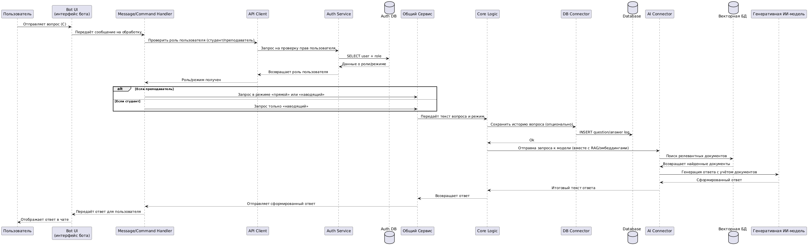
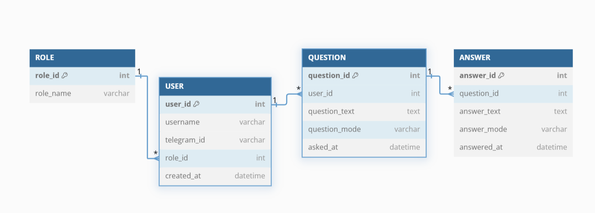

## Диаграмма контейнеров


## Диаграмма компонентов

**Компоненты «Bot application»**


**Компоненты «Общего Сервиса»**


## Диаграмма последовательности


## Модель БД


## Применение основных принципов разработки
1. **KISS (Keep It Simple, Stupid)**  
   - Структура кода должна быть максимально простой и понятной. Например, хранить логику обработки запросов в отдельных функциях/классах, не перегружая бизнес-логику лишними деталями.
   - Использовать удобочитаемые имена модулей и переменных, а также модули/библиотеки стандартной библиотеки Python (logging, sqlite, os и т.д.) там, где это уместно.
   
   Пример кода: 
   ```python
   def get_user_role(user_id: int) -> str:
    result = db.execute("""
        SELECT r.role_name
        FROM user u
        JOIN role r ON u.role_id = r.role_id
        WHERE u.user_id = ?
    """, [user_id])
    return result[0]["role_name"] if result else "guest"
   ```

2. **DRY (Don’t Repeat Yourself)**  
   - Вынести повторяющуюся логику (например, отправка сообщений в Телеграм, обращение к модели) в отдельные функции или классы.  
   - При использовании векторной БД или внешнего сервиса, обернуть их в отдельный модуль/класс, чтобы повторно не копировать код подключения и запросов.
   
   Пример кода: 
   ```python
   # telegram_bot.py

   import requests

   def send_telegram_message(user_id: int, text: str):
      """ Единая функция для отправки сообщений в Телеграм. """
      requests.post(
         f"https://api.telegram.org/bot{TOKEN}/sendMessage",
         data={"chat_id": user_id, "text": text}
      )

   def send_welcome(user_id: int):
      send_telegram_message(user_id, "Добро пожаловать!")

   def send_error(user_id: int, error_msg: str):
      send_telegram_message(user_id, f"Ошибка: {error_msg}")

   def send_answer(user_id: int, answer_text: str):
      send_telegram_message(user_id, answer_text)


   ```

3. **YAGNI**  
   Не реализовывать функциональность, которая возможно понадобится в будущем, если она не нужна прямо сейчас.

4. **SOLID**
   1. S – Single Responsibility Principle (SRP)
      -У класса/модуля должна быть **одна** причина для изменения.

      ```python
      # Пример
      class UserRepository:
         """Отвечает только за работу с хранением пользователей."""
         def __init__(self, db_connection):
            self.db = db_connection

         def get_user_by_id(self, user_id):
            # Логика доступа к БД
            pass

         def create_user(self, user_data):
            # Логика записи в БД
            pass
      ```
      - Этот класс отвечает **только** за операции с пользователями в БД, никак не смешивая логику работы с Telegram или генерации сообщений.

   2. O – Open/Closed Principle
      - Классы должны быть **открыты** для расширения, но **закрыты** для изменения.  

      Пример: мы можем добавить новые режимы ответа через **наследование** или **стратегии**, не меняя исходный класс.

      ```python
      class BaseAnswerMode:
         def get_answer(self, question):
            raise NotImplementedError

      class StudentAnswerMode(BaseAnswerMode):
         def get_answer(self, question):
            return "This is a student answer."

      class TeacherAnswerMode(BaseAnswerMode):
         def get_answer(self, question):
            return "This is a teacher answer. More detailed..."

      # Класс BotLogic не меняется, но мы можем передавать ему новую реализацию
      class BotLogic:
         def __init__(self, answer_mode: BaseAnswerMode):
            self.answer_mode = answer_mode

         def handle_question(self, question):
            return self.answer_mode.get_answer(question)
      ```
      - Мы можем добавить `ExpertAnswerMode` без изменения кода `BotLogic`.
   3. L – Liskov Substitution Principle
      - Подклассы должны быть заменяемы своими базовыми классами без нарушения работы программы.
      Если у нас есть базовый класс с неким интерфейсом, любая «дочка» должна поддерживать этот же интерфейс.

      ```python
      class BaseAIModel:
         def generate_response(self, prompt: str) -> str:
            """Возвращает ответ на заданный prompt."""
            raise NotImplementedError

      class ChatGPTModel(BaseAIModel):
         def generate_response(self, prompt: str) -> str:
            return f"ChatGPT simulated answer to '{prompt}'"

      # Функция, которая ожидает базовый класс BaseAIModel
      def process_question(model: BaseAIModel, question: str):
         response = model.generate_response(question)
         print(response)

      my_model = ChatGPTModel()
      process_question(my_model, "Какие переменные в C# называются int?")
      ```
   4. I – Interface Segregation Principle
      - Клиенты не должны зависеть от методов, которые они не используют.  
      Мы можем разделять обязанности на несколько абстрактных классов, чтобы не тащить всё подряд.

      ```python
      from abc import ABC, abstractmethod

      class SendMessageInterface(ABC):
         @abstractmethod
         def send_message(self, chat_id, text):
            pass

      class ReceiveMessageInterface(ABC):
         @abstractmethod
         def receive_message(self):
            pass

      # Два отдельных «интерфейса» вместо одного громоздкого
      class TelegramSender(SendMessageInterface):
         def send_message(self, chat_id, text):
            pass  # Логика отправки

      class TelegramReceiver(ReceiveMessageInterface):
         def receive_message(self):
            pass  # Логика получения
      ```
      - Так пользователи, которым нужен **только** отправляющий функционал, не зависят от методов приёма.

   5. D – Dependency Inversion Principle
      - Модули верхнего уровня не должны зависеть от модулей нижнего уровня. Оба вида модулей должны зависеть от абстракций. Лучше зависеть не от конкретного класса, а от некой «абстрактной сущности» (протокола/интерфейса).

      ```python
      class DatabaseInterface(ABC):
         @abstractmethod
         def save_data(self, data):
            pass

         @abstractmethod
         def load_data(self, query):
            pass

      class SQLiteDatabase(DatabaseInterface):
         def save_data(self, data):
            # Логика сохранения в SQLite
            pass

         def load_data(self, query):
            # Логика выборки из SQLite
            pass

      # Код «верхнего» уровня - BotLogic - не знает, какая именно БД под капотом:
      class BotLogic:
         def __init__(self, db: DatabaseInterface):
            self.db = db

         def process_data(self, data):
            self.db.save_data(data)
            # ...

      # При инициализации:
      db_instance = SQLiteDatabase()
      logic = BotLogic(db_instance)
      ```
      - Благодаря этому, смена SQLiteDatabase на, например, PostgresDatabase **не ломает** код BotLogic.